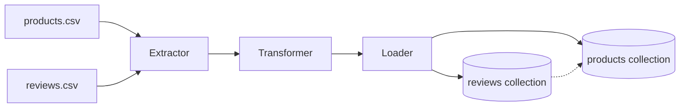

# mongo-ecommerce-review-analytics

> Status: ✅ Core pipeline complete

A MongoDB-backed ingestion and analytics pipeline for e-commerce product and review data.
Built as a standalone project to demonstrate document database schema design (embedding vs.
referencing tradeoffs), PyMongo-driven ETL, and MongoDB aggregation pipeline queries.

## Dataset

[Amazon E-commerce Products & Reviews Dataset](https://www.kaggle.com/datasets/lazylad99/amazon-e-commerce-product-and-review-dataset) (Kaggle, MIT license)
- `products.csv` — product metadata (brand, price, ratings summary, best-sellers rank, etc.)
- `reviews.csv` — customer reviews linked to products via ASIN, with sentiment scores

Raw data lives in `data/raw/`.

## Why this project

Built after completing MongoDB fundamentals and PyMongo study, to fix the concepts by
building something real. Core goal: make a deliberate, documented schema design decision
(what to embed vs. what to reference) and justify it with the actual data, not just dump
both CSVs into collections.

## Schema Design

Full reasoning in [`docs/schema_design.md`](docs/schema_design.md). Short version:
`products` and `reviews` are two separate, referenced collections (not embedded) — reviews
per product topped out at 19 in this dataset, well under any storage constraint, so the
decision came down to read/query independence rather than a forced size limit.

## Architecture



## Findings

Full results in [`docs/aggregation_findings.md`](docs/aggregation_findings.md). Highlights:
- Reviews with an attached image get roughly 3x the average helpful votes of reviews without
  one — the strongest signal found.
- Verified purchases skew slightly higher on both rating and sentiment than unverified ones.
- 28 of 728 products have zero reviews.


## Setup

Local MongoDB via Docker:

```bash
cp .env.example .env   # fill in real values
docker-compose up -d
```

- MongoDB: `localhost:27017`
- Mongo Express (optional web UI): `localhost:8081`

Create the collections, validators, and indexes:

```bash
python src/setup_schema.py
```

Run the pipeline:

```bash
python src/main.py
```

Run the aggregation queries:

```bash
python src/analytics.py
```

Run the tests:

```bash
cd tests
pytest -v
```

## Project Structure

```
mongo-ecommerce-review-analytics/
├── docker-compose.yml
├── .env.example
├── data/
│   └── raw/
│       ├── products.csv
│       └── reviews.csv
├── src/
│   ├── db.py
│   ├── extractor.py
│   ├── transformer.py
│   ├── loader.py
│   ├── setup_schema.py
│   ├── analytics.py
│   └── main.py
├── notebooks/
│   ├── exploration_reviews.ipynb
│   └── products_exploration.ipynb
├── docs/
│   ├── schema_design.md
│   ├── reviews_data_exploration_report.md
│   ├── products_data_exploration_report.md
│   ├── aggregation_findings.md
│   └── screenshots/
└── tests/
    ├── test_transformer.py
    └── test_loader.py
```

## Tech

- Python, PyMongo
- MongoDB (local/Docker)
- pandas (CSV → dict transformation step)
- pytest (testing)

## What I'd do differently

- Cardinality in this dataset (max 19 reviews per product) is low enough that embedding
  would have worked technically — the referencing decision here is about read/query
  independence, not a forced storage limit. A dataset with thousands of reviews per product
  would make the decision automatic instead of a judgment call.
- Would add proper `pydantic` validation ahead of the Loader in a v2, rather than relying
  only on MongoDB's `$jsonSchema` validators.
