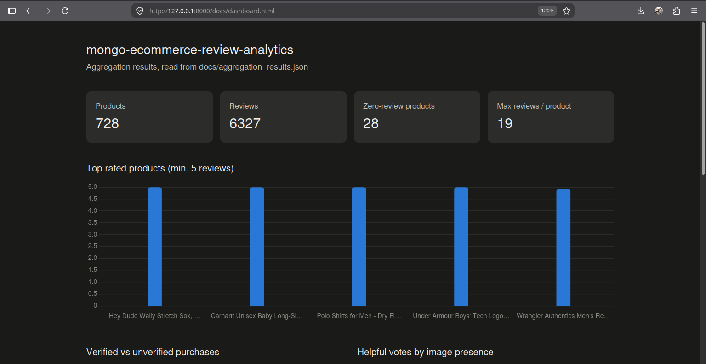

# Aggregation Findings

Results from the six aggregation queries in `src/analytics.py`, run against the loaded
`products` and `reviews` collections. Each query traces to a question from the exploration
candidate-question lists.

## Q1: Top rated products (minimum 5 reviews)

| asin | title | avg_rating | review_count |
|---|---|---|---|
| B0CS2YYTM4 | (product title) | 5.00 | 10 |
| B0C7HKDQH3 | (product title) | 5.00 | 10 |
| B0DN375DNC | (product title) | 5.00 | 10 |
| B0CJWGMKVD | (product title) | 5.00 | 5 |
| B074KL2SHP | (product title) | 4.93 | 14 |

Several products hold a perfect 5.0 average across 10 reviews — worth a manual spot-check
before trusting this as a genuine "best" list rather than a small-sample artifact, since 10
reviews is still a small denominator.

## Q2: Verified vs. unverified purchases

| verifiedPurchase | avg_rating | avg_sentiment |
|---|---|---|
| False | 4.42 | 0.24 |
| True | 4.54 | 0.31 |

Verified purchases skew slightly higher on both rating and sentiment. The gap is small, not
dramatic — not strong enough evidence to claim unverified reviews are meaningfully less
positive, but consistent with the direction one might expect.

## Q3: Biggest rating/sentiment disagreement

| asin | title | avg_gap |
|---|---|---|
| B0C8MT7B74 | (product title) | 1.42 |
| B0CSG34RQS | (product title) | 1.15 |
| B08FBLCCWT | (product title) | 1.00 |
| B0CKTCWQX6 | (product title) | 1.00 |
| B09R7YKSM1 | (product title) | 1.00 |

These are the products where star rating and text sentiment disagree most — cases worth
reading manually, since a large gap usually means either sarcasm, a rating that doesn't match
the review text, or a sentiment model struggling with the specific phrasing used.

## Q4: Average price by top-level category

| category | avg_price |
|---|---|
| Sports & Outdoors | $38.40 |
| Clothing, Shoes & Jewelry | $35.36 |
| Electronics | $33.98 |

Only three top-level categories present in this dataset. Sports & Outdoors carries the
highest average price, though the category counts behind these averages should be checked
before treating this as a strong signal — a small category can swing an average easily.

## Q5: Helpful votes vs. image presence

| has_image | avg_helpful_votes |
|---|---|
| False | 2.86 |
| True | 8.69 |

Reviews with at least one attached image get roughly 3x the average helpful votes of reviews
without one. This is the clearest signal in the whole set — worth noting as the standout
finding of the analysis.

## Q6: Products with zero reviews

**28 products** have no matching review documents — consistent with the referential
integrity check from the exploration phase (700 of 728 products have at least one review).

---

*Screenshot of the live query output:*

