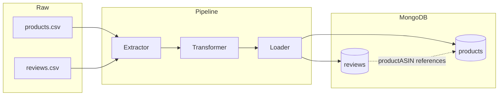

# Schema Design

> This document lists the reasoning behind the database design and the schema I'll be
> following.

## Products & Reviews — Embed or Reference

> Decision: Referencing

### Why?

1. **Read pattern** — not a strong determinant on its own, since it depends on the view and
   the consumption pattern. Reading a product's details together with a handful of its
   reviews (e.g. a product detail page) leans toward reading both together, which would argue
   for embedding. But wanting an aggregation or summary across all reviews independent of any
   one product leans the other way, toward reading reviews on their own — which argues for
   referencing. Since both patterns are genuinely present here, this point alone doesn't
   settle the decision.

2. **Growth rate** — I'm not claiming this dataset reflects Amazon's real review volume; the
   full-scale version of this kind of data can carry thousands of reviews per product. In my
   sample, review counts are far smaller (max 19 per product), which on its own would make
   embedding technically safe — well under MongoDB's 16MB document limit, so storage isn't a
   constraint either way.

   But the deciding factor is that this is fundamentally an **analytics-oriented design**,
   meant to answer analytical questions later, not just serve a product page. Some questions
   are answerable from `products.csv`'s own summary fields alone (e.g. rating distribution,
   average rating) — a general, product-level view that doesn't need individual review
   records at all. Other questions need to go deeper into individual reviews (e.g. correlating
   `verifiedPurchase` with `sentiment_score`, or finding where star rating and text sentiment
   disagree) — that need for row-level granularity is what makes referencing the stronger
   choice, independent of the storage-size question.

> That's what it comes down to: the choice here isn't "referencing was forced" — it's
> "referencing better matches the independent-access reasoning, even though the size
> constraint didn't force it." A dataset with thousands of reviews per product would have made
> this decision automatic; here, the 16MB ceiling was never in danger, so the real argument
> for referencing has to stand on the query patterns themselves, not on a hard limit.

---

## Collections

Two top-level collections, matching the two source files and the reasoning above.

### `products`

One document per product. Source: `products.csv` (728 rows, `asin` unique).

Raw fields going into this collection: `asin` (used as `_id` or a unique indexed field),
`title`, `about_item`, `product_description`, `brand_name`, `brand_page_url`, `manufacturer`,
`model_number`, `availability`, `price_value`, `list_price`, `product_url`, `all_images`,
`seller_name`, `seller_page_url`, `breadcrumbs`, `best_sellers_rank`, `rank_1`,
`delivery_date`, `fastest_delivery_date`, `default_variant/0`, `default_variant/1`,
`default_variant/2`, `scrape_time`.

Fields that fold into a nested **rating snapshot** rather than staying flat, since exploration
confirmed these are stale relative to the live site and tied to `scrape_time`:
`rating_stars`, `rating_count`, `rating_distribution/1star` through `/5star`,
`customer_review_summary`, `recent_purchases`.

### `reviews`

One document per review. Source: `reviews.csv` (6,327 rows, `reviewID` unique,
`productASIN` referencing `products.asin` with zero orphans).

Fields: `reviewID` (used as `_id` or a unique indexed field), `productASIN` (the reference
field, indexed — this is what the `$lookup` joins on), `rating`, `reviewTitle`, `reviewText`,
`cleaned_review_text`, `sentiment_score`, `verifiedPurchase`, `helpfulVoteCount`,
`reviewPosition`, `reviewURL`, `reviewMetadata`, `productVariant`, `images/0` through
`images/7`, `videos/0`.

## Notes Carried From Exploration Into the Schema

- `best_sellers_rank` is not re-parsed as a raw string — `breadcrumbs` already gives category,
  `rank_1` already gives the numeric sub-rank.
- `default_variant/0-2` and `all_images` become real nested arrays in the document instead of
  numbered flat columns — the natural benefit of moving off CSV.
- `all_images` needs `ast.literal_eval` in the Transformer, not `json.loads`, since it's a
  Python-list-formatted string with single quotes, not valid JSON.

## Architecture

`products` and `reviews` are two separate collections, related by `reviews.productASIN`
pointing at `products.asin` — a reference, not an embed, per the decision above. The dotted
line marks that relationship; there's no physical foreign key in MongoDB, so this link only
exists at the application/query level, enforced through `$lookup` when needed and through
the referential integrity already checked during exploration.

## Indexing

Indexes are chosen based on the fields the design above and the planned aggregation queries
actually filter, sort, or join on — not created speculatively.

| Collection | Index | Type | Why |
|---|---|---|---|
| `products` | `asin` | unique | Primary lookup key; also the `$lookup` target field from `reviews` |
| `reviews` | `reviewID` | unique | Primary key for the collection |
| `reviews` | `productASIN` | single-field | This is the reference field — every `$lookup` from `reviews` back to `products`, and every "all reviews for this product" query, filters or joins on it |
| `reviews` | `rating` | single-field | Supports rating-based filtering/sorting (e.g. "reviews with rating >= 4") |
| `reviews` | `productASIN, rating` | compound | For queries that filter by product and rating together (e.g. "this product's reviews above 3 stars") — compound because both fields are used together, not just each alone |

No index is planned on free-text fields (`reviewText`, `product_description`) at this stage —
a text index would only be worth adding if a full-text search feature becomes part of the
project's scope, which it currently isn't.